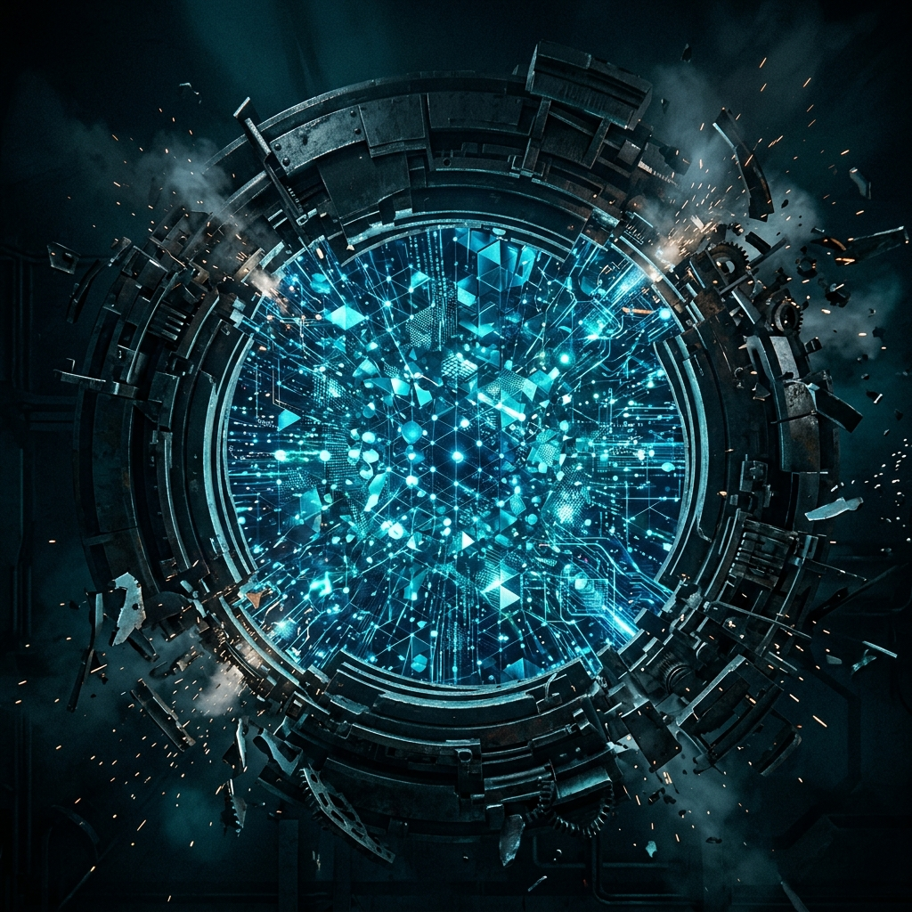

There is a quiet crisis paralysing the security leadership community. Embedded within our operational DNA is a pathological need for consensus and an instinctive bias toward caution. As we navigate the "Collision Space"—the turbulent intersection of emerging AI capabilities and established security frameworks—this caution is no longer a virtue. It is an active vulnerability. By continuously shrinking our scope to focus only on immediate, perfectly understood risks, we are surrendering the tactical advantage.

This phenomenon is what I term **Defensive Aperture Collapse**. It is the operational tendency for security practitioners to narrow their worldview strictly to immediate threat mitigation and compliance checkboxes, artificially blinding themselves to systemic paradigm shifts. When the aperture collapses, we stop building new capabilities and restrict ourselves to fighting yesterday's fires with yesterday's tools. 

### The Cost of Nerfing Ourselves

[In his argument for "Full Activation"](https://danielmiessler.com/blog/its-time-for-full-activation), Daniel Miessler captures the frustration of realizing that we constantly temper our own ambitions to avoid peer criticism. In the security domain, this self-censorship is systemic. If a Chief Information Security Officer or a Head of Cyber Defence proposes an aggressive, experimental architecture utilizing LLMs to dynamically reshape network topologies, the immediate room reaction is typically a chorus of "What about prompt injection?" or "Has this been NIST-certified?"

We have professionalized the act of nerfing ourselves. We require 100% approval from our peers before deploying an idea, which guarantees that only the most watered-down, uninspired, and inherently reactive solutions see the light of day. In a stable environment, this process minimizes downside risk. In a Cambrian explosion moment for threat actors, this process guarantees irrelevance.

### Choosing to Build in the Noise

If we accept that the threat landscape is fundamentally changing due to AI acceleration, the only logical counter-move is to out-build the adversary. We can no longer afford to be solely the department of "No." We must become the department of "Yes, and here is the aggressive new architecture that supports it."

We have to fight the instinct to wait for the major vendors to consolidate their AI offerings into a safe, consumable product. The old guard is inherently slow to pivot, relying on established tribal knowledge rather than disruptive innovation. If you are waiting for a commercially safe, universally approved solution to the risks of sovereign AI agents operating within your perimeter, you will be waiting until you are already breached.

### Critical Review & Failure Points

The immediate counterargument to "building aggressively" is the blast radius of failure. If we rapidly deploy custom AI-driven response mechanisms or experimental architectures without fully characterizing them, are we not just introducing instability into environments we are paid to protect?

The adversarial critic will rightly point out that rapid deployment of unverified systems often results in self-inflicted denial of service. The logic argues: "It is better to be slow and secure than fast and breached by our own tools."

This critique assumes the baseline environment is actually secure. It rarely is. The failure mode of action is chaotic, but the failure mode of inaction is extinction. Yes, building aggressively in the Collision Space introduces risk. However, that risk can be managed through rigorous compartmentalisation rather than through paralyzing hesitation. We must learn to sandbox our ambition, not stifle it entirely.

### Stepping Into Full Activation

To break out of the Defensive Aperture Collapse, practitioners must actively change their operational culture.

1. **Reject Pathological Consensus:** If an architectural proposal has universal peer approval, it is likely too conservative. Actively sponsor experimental projects that make the traditional compliance team nervous, provided the blast radius is controlled.
2. **Build, Do Not Just Buy:** Stop waiting for vendors to perfectly map to your unique environment. Use the current generative tools at your disposal to script, automate, and build tailored defensive capabilities immediately.
3. **Embrace Partial Progress:** Release defensive tools and policies internally even if they only solve 30% of the problem. A partially deployed heuristic that blocks a novel attack is infinitely more valuable than a perfect framework sitting in a draft folder for two years.
4. **Widen the Aperture:** Force your team to spend 20% of their operational cycles analyzing disruptive technologies beyond the immediate threat horizon. Understand how these capabilities can defend your environment before the adversary figures out how to attack it.
