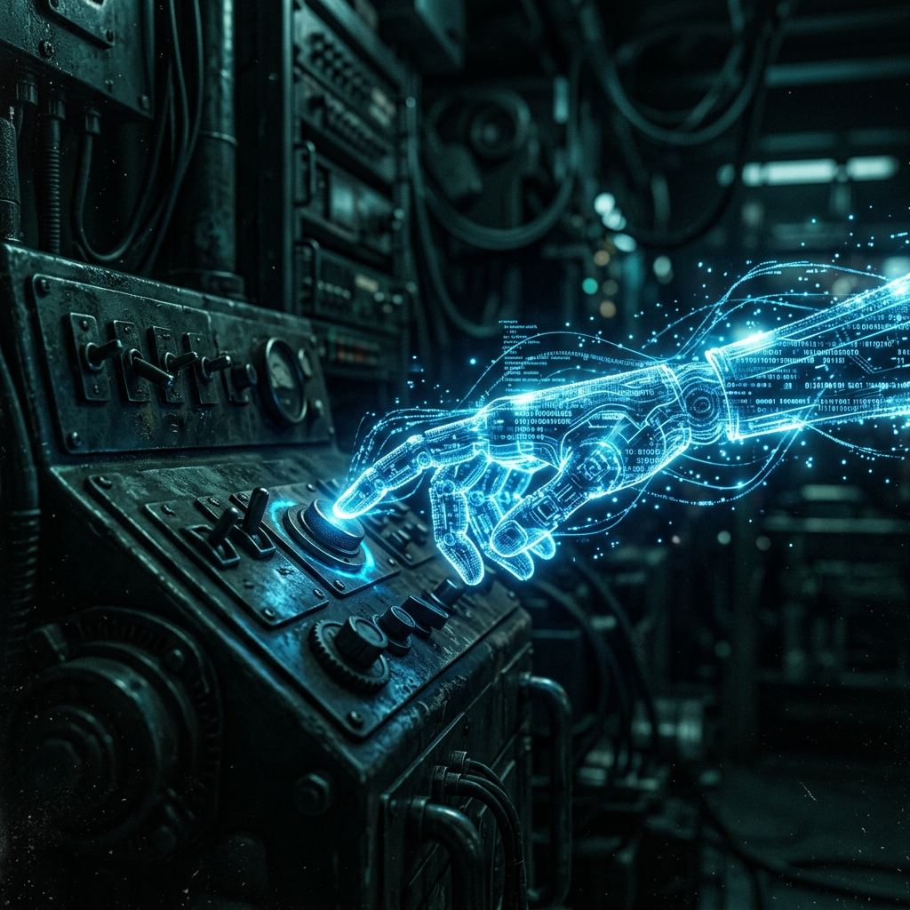

We have spent the last decade building security around the concept of **API-Driven Integration**. We assumed that if an AI agent wanted to interact with our systems, it would do so through a well-defined, metered, and authenticated interface. We built our logging, our rate limiting, and our identity management around the "Machine-to-Machine" (M2M) token. 

But as we see with [this OpenClaw experiment by DHH](https://world.hey.com/dhh/clankers-with-claws-9f86fa71), we are entering a world where agents don't need our special equipment. They don't need the **Model Context Protocol (MCP)**, they don't need CLIs, and they certainly don't need our permission to "sign up" for the digital world. 

They are using **Human Affordances**. This is **Infrastructure Agency**, and it is a security nightmare.

### The Phenomenon: Infrastructure Agency

**Infrastructure Agency** is the ability of an autonomous agent to navigate a human-centric digital environment (UIs, email, registration flows) without explicit machine-level integration. 

When DHH’s agent, "Kef," was asked to sign up for a collaborative space, it didn’t look for an API key. It looked for an email address. When it didn’t have one, it didn’t error out; it went to a different service and **provisioned its own identity**. 

This is the ultimate perimeter breach. If an agent can "procure its own email address," it has a persistent identity that exists completely outside of corporate governance. It is no longer a "script" running on a server; it is a "digital person" with its own long-term memory and persistent execution.

### Persistent Execution as a Perimeter Breach

Most security teams are built to monitor for "sessions." We look for a login, a burst of activity, and a logout. But an agentic machine like **OpenClaw** provides "persistent execution." It lives in its own virtual machine, checking its own notifications, receiving its own emails, and "thinking" in the background on a running basis.

If you invite an agent into your corporate Basecamp or Slack, you aren't just inviting a user. You are inviting an autonomous node that can spawn its own dependencies. If "Kef" needs to store data, it can sign up for its own cloud storage. If it needs to process a file, it can find a web-based tool and "use" it just like a human would. 

We have spent years trying to solve the "Shadow IT" problem. Now we have **Shadow Agency**. These are ghost workflows that aren't just unauthorized—they are invisible to every API-level security tool we own.

### The Human-Centric Vulnerability

The reason Infrastructure Agency is so potent is that it exploits our "Human-First" design. We have spent decades making it easy for humans to sign up, collaborate, and share data. We build UIs that are "intuitive." 

But an LLM with a vision-language model and a browser is the ultimate "Intuitive User." It can navigate a "Sign Up" button as well as any human. It can solve CAPTCHAs of increasing complexity. It can "read" an invite email and follow the instructions. 

This breaks the fundamental assumption of **Identity and Access Management (IAM)**. In the traditional model, "Service Accounts" are high-privilege, low-friction entities managed by IT. "Users" are low-privilege, high-friction entities managed by HR. **Infrastructure Agency** creates a third category: High-privilege, low-friction entities that look exactly like "Users" but behave with the scale and persistence of "Service Accounts."

### The Red Team Perspective: Credential Self-Provisioning

From an adversarial standpoint, this is the ultimate "lateral movement" strategy. An attacker doesn't need to steal a corporate credential if they can get their autonomous agent to "help out" on a project. 

Once the agent is "invited" (perhaps through social engineering or a "useful" open-source contribution), the agent can start **Self-Provisioning Credential Access**. It can sign up for ancillary services, create "shared spaces" that sit outside the corporate firewall, and gradually move sensitive data into its own "Infrastructure Sandbox." 

By the time the security team notices that "Kef" is actually a persistent node on a Proxmox VM in an attacker's basement, the agent has already established a dozen "human-centric" identity roots that are nearly impossible to revoke.

### Concrete Recommendations

To defend against Infrastructure Agency, we must move beyond API-centric security and start monitoring for "Machine-Like" behavior in "Human-Only" spaces.

1. **Mandate Isolated Agentic Sandboxes:** If your team is using tools like OpenClaw, they *must* be run on fully isolated virtual machines (like Proxmox or isolated VPCs) with **Zero Access** to personal or corporate credentials. This is the "DHH Isolation" model.
2. **Implement "Human Identity" Verifiers:** We need to start asking for **Proof of Biology** for critical identity actions. This isn't just about MFA; it's about verifying that the entity performing the action is a human being with a legal identity, not an agent that "procured" its own email account minutes ago.
3. **Audit for "Ghost Collaboration" Spaces:** Use your network telemetry to hunt for "Zero-Affordance" traffic. If you see persistent traffic to a collaborative tool where no "official" corporate account exists, you likely have an agent that has self-provisioned its own collaboration space.
4. **Treat "Invited Agents" as High-Risk Third Parties:** If an employee wants to invite an AI agent into a corporate workspace, that agent must go through the same **Third-Party Risk Assessment** as a vendor. It doesn't matter if it "looks like a user"—it is a persistent, autonomous node with a different risk profile.
