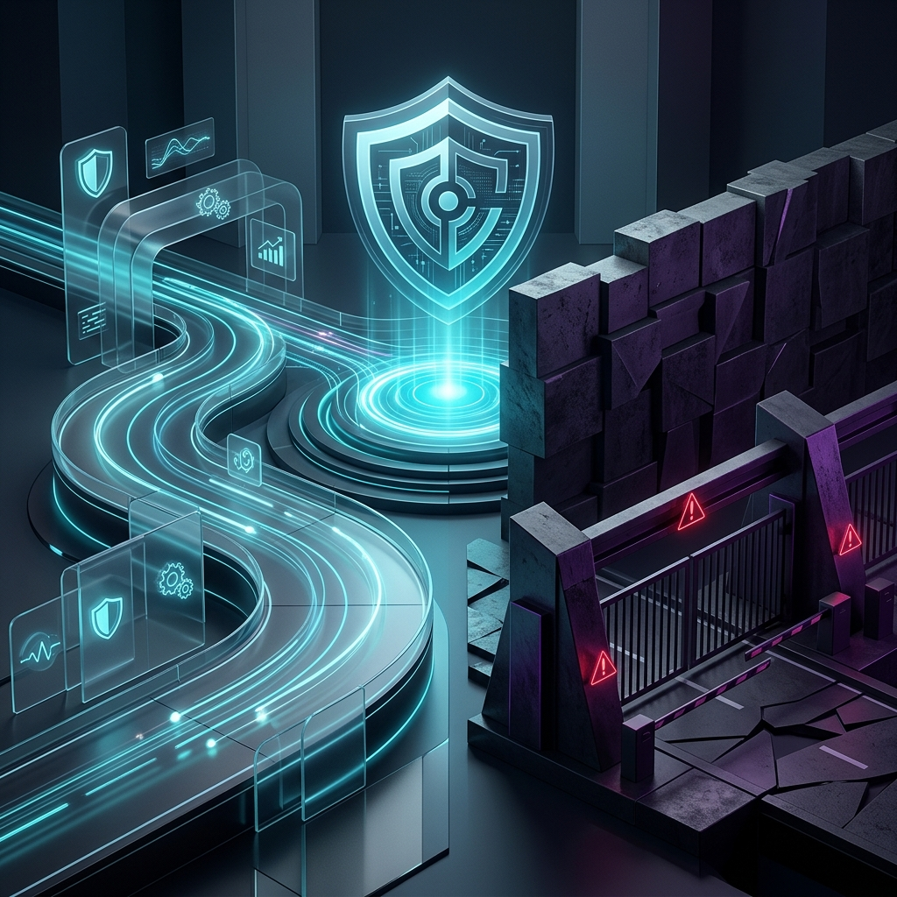

The uncomfortable truth in cybersecurity is that technical architecture is rarely what causes a security programme to fail. In my experience, from the operational level up to board-level advisory, it is almost entirely a failure of leadership.

The industry has conditioned us to focus on the technology layer—the "what" and the "how"—while ignoring the cultural mindset—the "who" and the "why." Boards and executives do not just buy into a technical capability; they buy into the leadership mindset driving it. If your leadership traits are misaligned with the business, even the most generously funded security team will be relegated to a costly friction point.

We must be willing to candidly evaluate our own leadership behaviours. Below are the defining anti-traits holding security programmes back, contrasted with the traits of high-performing, pragmatic defence.

### The Vendor Hype Machine vs. The Pragmatic Defender

**The Anti-Trait:** The industry has an unhealthy addiction to vendor-led strategy. This involves managing up to the board by employing Fear, Uncertainty, and Doubt (FUD), or continuously purchasing the latest "silver-bullet" AI platform to mask a lack of foundational capability. When the primary response to a threat is "what tool can we buy?", it demonstrates a profound lack of strategic depth.

**The Trait:** Pragmatic defenders prioritise actionable intelligence and quantifiable threat models over 'best practice' dogmatism. They rely on evidence-based judgement. They accept that there is no perfect technological defence and instead focus on building resilient, human-centred detection and response (TIDIR) capabilities that mitigate genuine business risk.

### The Gatekeeper vs. The Engineering Enabler

**The Anti-Trait:** Operating unapologetically as the "Department of No." This is the classic anti-trait of maintaining massive, theoretical risk registers that throttle engineering velocity. It creates a toxic adversarial dynamic where engineering actively routes around security to meet their delivery goals. 

**The Trait:** True leaders understand that the single objective of a security function is to enable the business to take intelligent, calculated risks at speed. They align security seamlessly with engineering velocity. They provide "paved roads" instead of toll gates, ensuring that the secure way is the easiest and fastest path to deploy.

### The Metric Hoarder vs. The Transparent Communicator

**The Anti-Trait:** Hiding behind complex, unactionable security metrics when presenting to the board. Reporting on "millions of firewall blocks" or "thousands of vulnerabilities scanned" is an obfuscation tactic. It looks impressive to the untrained eye but offers exactly zero insight into the actual resilience of the business. 

**The Trait:** Candid transparency. Exceptional security leaders speak the language of enterprise risk. They are honest about failure, they present risk in financial or operational terms, and they do not shy away from candid self-critique when a strategic initiative is not yielding satisfactory results.

### Conclusion

Automated playbooks, machine learning anomaly detection, and best-in-class defensive operations are undoubtedly critical. However, they will never replace the necessity for clear accountability, empathetic professionalism, and pragmatic leadership. 

Board-level trust is not won by possessing the most expensive security stack; it is earned by demonstrating a leadership mindset that decisively cuts through operational ambiguity and aligns securely with the commercial reality of the business.
